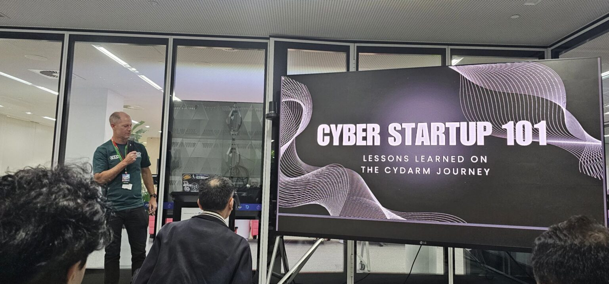
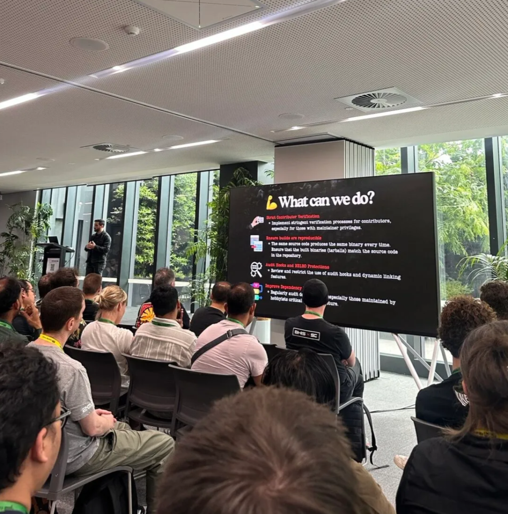
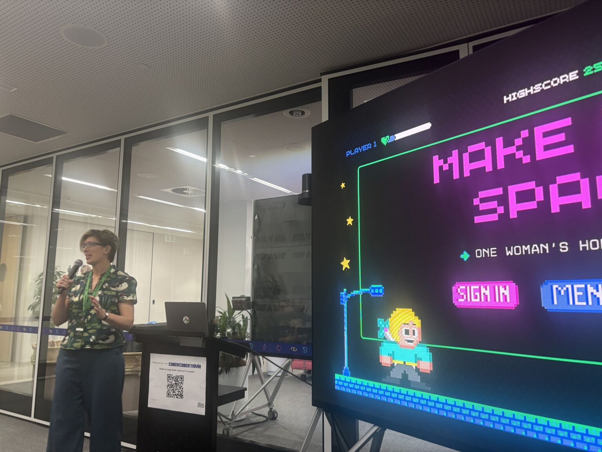
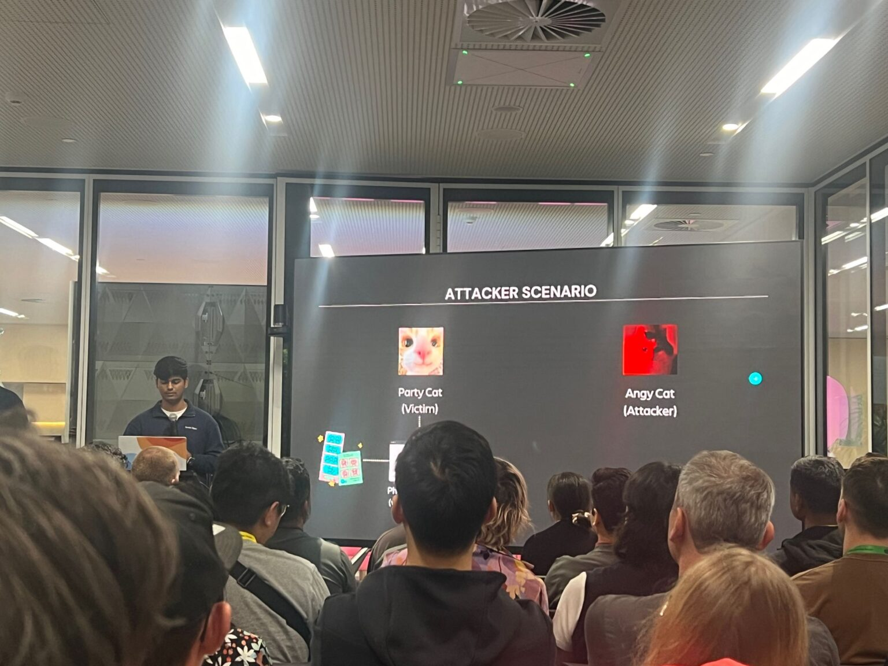
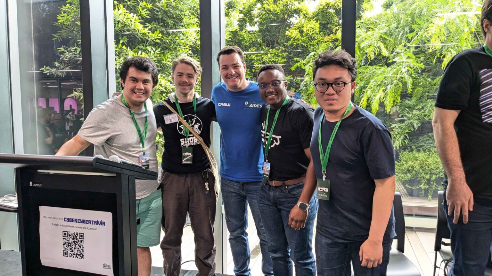

As the final few weeks of the year draw closer, the team at DUCA can’t help but reminisce on all the amazing opportunities we have been fortunate enough to be a part of. One of these moments is attending BSides Melbourne, conveniently hosted as Seek HQ on November 15-17. Through a combination of personal and technical skill building and all the delicious catering, BSides Melbourne presented a special environment for both newcomers and cyber veterans. We would like to give a shout out to some of the speakers that we were able to listen in on during the conference.

#### Cyber Startup 101: Lessons Learned on the Cydarm Technologies Journey – Vaughan Shanks

Considered the “startup guru”, Vaughan Shanks provided an honest recounting of building his cybersecurity startup Cydarm Technologies, highlighting the importance of resilience and innovation and the highs and lows of such a journey. His unique experience and advice brought the startup journey to life — especially for those of us particularly interested in entrepreneurship.

#### The XZ Backdoor Story: The Undercover Operation That Set the Internet on Fire – Thomas Roccia

Thomas Roccia provided a fascinating exploration of the XZ backdoor, through engaging storytelling and visuals. Roccia describes a rogue developer Jia Tan, who implemented a backdoor within the XZ/liblzma library — a plan that was years in the making. This deep-dive provided us with comprehensive insights into thorough investigation to avoid potentially disastrous consequences if left unchecked.

#### Make Her Space: One Woman’s Homelab Journey – Claire Carpenter

Improving a resume is a continuous journey for students, and Claire Carpenter provided a complete guide on crafting a safe environment to learn and improve our technical abilities through the use of a homelab. With a strong focus on collaboration, Carpenter led a community-driven discussion, opening the doors for those of us who are seeking a starting point in our own homelab journey.

#### OAuth Hacking Marathon – Exploiting Common Security Pitfalls and Mitigating Them – Kaif Ahsan, Kumar Soorya

This humour-filled presentation led by Kaif Ahsan and Kumar Soorya, explored various OAuth vulnerabilities, demonstrating exactly how adversaries utilise these exploits and ways in which to defend a product against these types of threats. Each live demo was both intriguring and intimidating seeing how easy it can be to exploit OAuth systems. Safe to say, we feel much better equipped to mitigate these threats as a result of their talk (You won’t be forgiven, Angy Cat).

BSides Melbourne proved itself to be an invaluable experience to our members, and it is always such a privilege to be able to learn from industry leaders and connect with like-minded individuals in the cybersecurity field. To wrap up the BSides experience, DUCA had the opportunity to get involved with the ‘Cyber Cyber Trivia’ (double the fun with double the cyber 😉), where we were able to put all the incredible knowledge we had learnt to the ultimate test! It truly was the ideal way to end off a weekend of learning and networking.

DUCA wants to extend its heartfelt thanks to all the amazing speakers, organisers, and staff who came together to put on this unforgettable experience. Attending this conference as DUCA’s first is a milestone we will always cherish, and we’re so grateful to have been a part of it.
