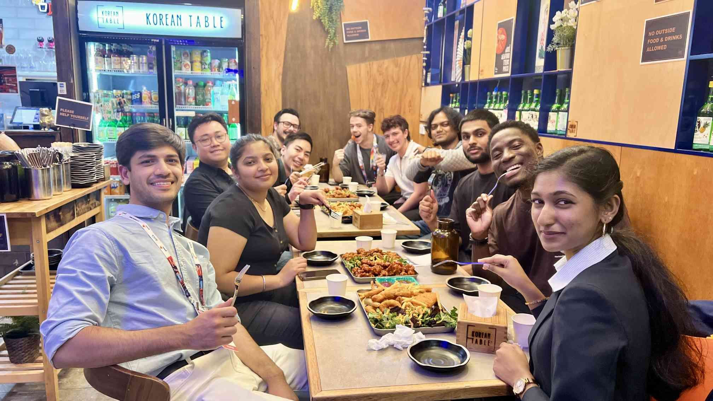

DUCA had the honour of attending the Australian Cyber Conference Melbourne 2024 from November 26–28. This prestigious event included the subject “Future is Now.” This annual conference, which was organised by the Australian Information Security Association (AISA), gave experts a forum to talk about emerging technologies and the urgent issues surrounding safeguarding our digital future.  

With captivating keynote addresses, stimulating panel discussions, and practical demonstrations, the conference offered unmatched insights into the constantly changing field of cybersecurity. This event gave DUCA the chance to broaden our perspectives, connect with prominent figures in the field, and become fully immersed in the technologies that will shape the future. 

This blog post highlights the conference’s major events, remarkable presentations, and important takeaways that will motivate our members to take the lead in cybersecurity. 

## Event Highlights 

### Motivational Keynote Addresses 

The conference began with an insightful keynote by Joe Sullivan, establishing the tone for the day. As the day progressed, astronaut José Hernández closed Day 1 with an inspirational journey of perseverance, reminding us of the importance of resilience and encouraged us to apply it in our lives as well. 

 
### Captivating Talks and Sessions at a Glance 

#### Alexey Bocharnikov (Accenture)

🔒 Nothing Stays Secret Forever. Tech advances, codes get broken. Quantum’s just the latest exploit. 

Alexey gave an enlightening talk about the difficulties of the quantum age, dispelling misconceptions about quantum computing and highlighting how urgent it is to get ready for disruptions brought on by the quantum. 
 
#### Monika Kirk & Alexander G. (Deloitte) 

🔒 Adaptive Threat Intelligence: Predicting the Unpredictable 

The session explored advanced threat intelligence technologies such as decentralized intelligence networks, blockchain, quantum computing, and AI/ML.  
 
#### Robin Doss & Syed W. Shah (Deakin University)

🔒 Quantum Resilience: A Trustworthy Internet in the Post-Quantum Era 

The two talked on the difficulties in making the switch to post- quantum cryptography, pointing out that many of the algorithms used by NIST are still unstable. 
 
#### Evan Vougdis & Chantelle Ralevska

🔒 Inside the Mind of an Attacker: From Hacked to Hack-Proof 

A practical session diving into the motivations behind cyberattacks and strategies to build robust defenses. 
 
#### Malcolm Shore & Carsten Boeving

🔒 SOC200 and Threat Hunting with Kali Purple 

An outstanding demonstration of Kali Purple and its open-source tools that highlights Malcolm’s toolset’s versatility—a unique cybersecurity Swiss Army knife. 

#### Jamie Wiggins, Edward Messina, and Ricki Burke 

🔒 Career Village Discussion

A conversation about igniting enthusiasm in cybersecurity roles and career motivation captivated the audience.

#### Mike Pritchard

🔒 All about Enigma  

Demonstrated how WWII encryption techniques impacted contemporary computers, bringing history to life with a display of the Enigma machine.

#### Carter Smith (CyberCX)

🔒 What you don’t know can hurt you  

Carter highlighted the concerning but little-known potential of Mobile AD Identifiers (MAIDs). These distinctive identifiers are frequently used for targeted advertising, but they also provide potential for more sinister uses. Key discussion points included how MAIDs transmit identifying information such as IP addresses and geolocation to Ad servers, and practical demonstrations of the use of MAIDs in Open-Source Intelligence (OSINT) investigations. 

#### Rohit Borekar (Solution Tech)

🔒 AI driven cybersecurity defense and offense 

Borekar offered insights into how AI is transforming both defense and offensive cybersecurity. 
 
#### Christopher Hills (BeyondTrust)

🔒 What can we learn from today to protect the future  

Examined how important identity protection is in light of the growing complexity of cyberthreats. Threat actor strategies (e.g., Mango Sandstorm, Midnight Blizzard) and real-world cases, such as the 2023 Okta Support team hack, were studied. Participants departed with practical methods for controlling vulnerabilities, reducing risks, and safeguarding access to privilege. 
 
#### Simon Gribble (Deloitte)

🔒 The Call is Coming from Inside the House: The Ticking Time Bomb That is Legacy Cyber Security Technology  

A stimulating discussion about the unspoken dangers of outdated cybersecurity technology. He explored the idea of “zombie technologies”—platforms that aren’t getting enough money for research and development, which results in technological debt and makes them easy targets for threat actors. Gribble advised how outdated security technologies turn into liabilities, instances of threat actors taking advantage of older technologies, and feasible actions leaders may take to spot warning indicators and make backup plans. 

### Facinating Expo Interactions

The energy-filled expo floor provided a wealth of opportunity to network, educate, and share ideas with innovators and leaders in the field. It was the ideal combination of networking and learning, with everything from captivating product demos to in-depth discussions about cutting-edge technologies. Every conversation highlighted the value of cooperation and ongoing education in this ever-evolving area, whether it was about routes for under-represented groups or investigating cutting-edge tools like Kali Purple. Meeting so many enthusiastic people who are shaping the future of cybersecurity has been such a fulfilling experience! 

The Australian Cyber Conference was not just an event, but it served as an opportunity for creativity, connections, motivation, and inspiration. From vibrant talks to vast exhibition contacts, the conference demonstrated that collaboration and shared skills are essential for the future of cybersecurity. 

> “The last two days have been nothing short of amazing, filled with inspiring conversations and invaluable insights. [..] What an incredible day meeting inspiring people and diving into the world of cybersecurity!” – DUCA Member, Ryan Fox on LinkedIn

One of the most intriguing takeaways was the eagerness of industry executives to meet with the future generation of cybersecurity professionals. DUCA is excited to announce forthcoming guest speeches and panel events in which these experts will share their experiences and insights, allowing students to learn directly from the finest in the industry. 

Looking ahead, DUCA is reinforcing its commitment to providing members with real-world skills and opportunities. With the connections and information we have gathered, we are eager to push the boundaries and strengthen the cybersecurity community. Together, we are not just learning but also leading. Stay tuned for additional opportunities to develop, network, and make a difference and let’s keep this momentum going! 

DUCA is a student-led club and any interaction with our content helps our reach and impact on the cybersecurity community. We’d love for you to share this post with your network and share your thoughts in the comments! 
