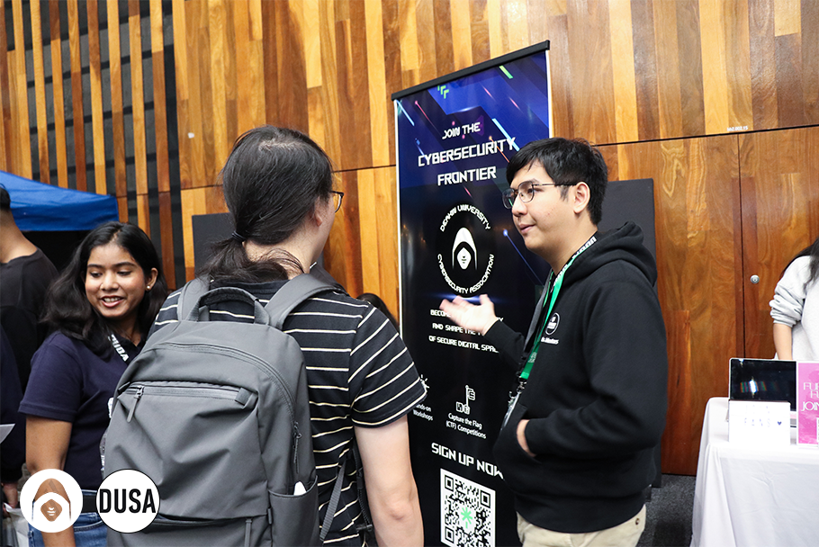
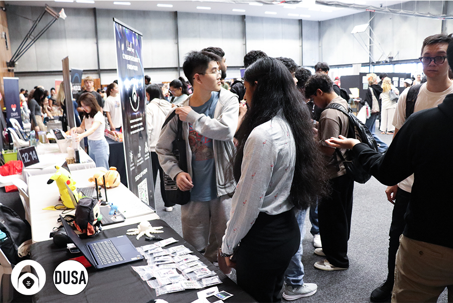
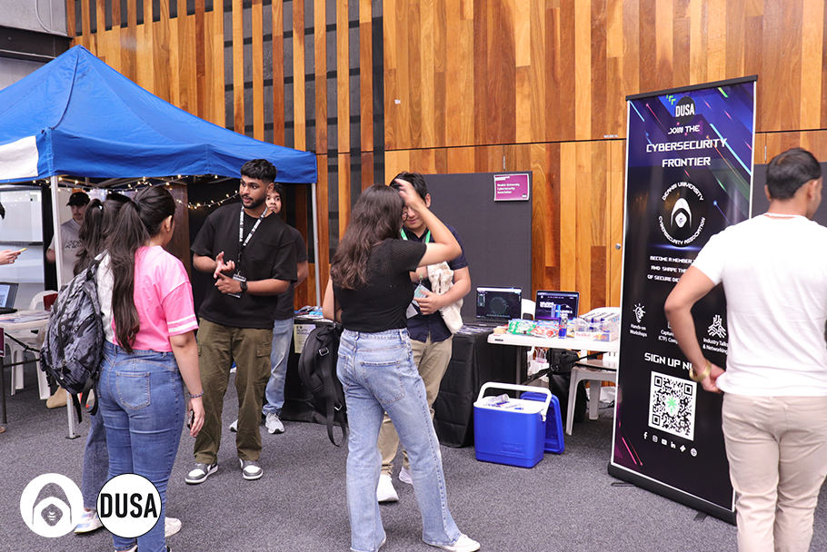
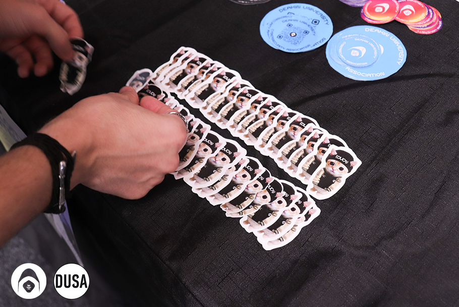
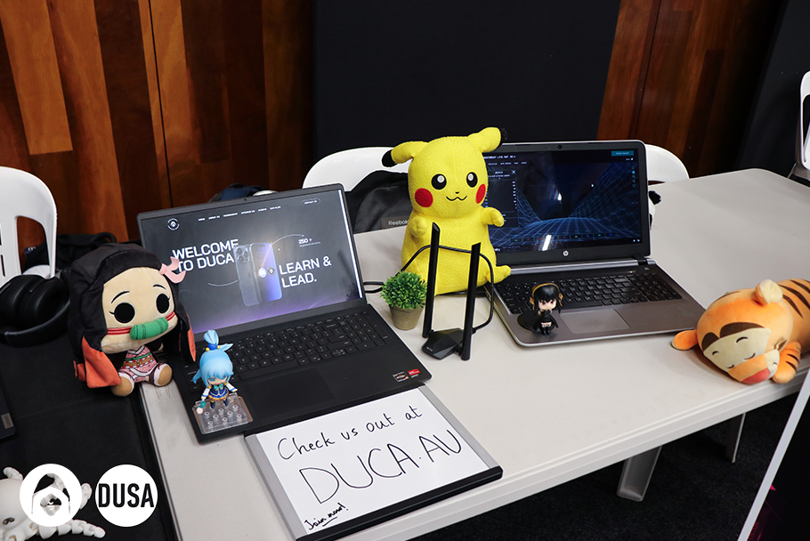

We just want to take a moment to express our heartfelt gratitude to everyone who visited us during O-Week! 🤍 The energy, excitement, and enthusiasm we felt over the past week have been nothing short of amazing, and we are absolutely blown away by the incredible interest in both our club and the events we’ve got lined up for the year. What an unforgettable start to Trimester 1!

In fact, we are thrilled to announce that we welcomed over 90 new members to the DUCA community this week alone! 🤯 It’s truly inspiring to see so many passionate individuals join our growing network of aspiring cyber professionals. Whether you’re just starting your journey or are already well on your way in the tech world, DUCA is the perfect place to connect with like-minded individuals, gain valuable insights, and take your cyber career to the next level.

#### For New Members: Your Exclusive O-Week Certificate is Coming Soon!

To all of you who signed up during O-Week — thank you again for your commitment to your cyber journey! As a special token of appreciation, we’ll be sending out a very exclusive O-Week Certificate to all our new members via email next week. 🎉 Not only is this certificate a great way to celebrate your first step in joining DUCA, but it’s also the perfect addition to your LinkedIn profile. 🚀 It shows future employers and connections that you’re serious about pursuing a career in cybersecurity and that you’re already taking active steps toward building your knowledge and network in the field.

If you’re looking for that extra bit of credibility to stand out in the competitive world of cyber, this certificate is a great way to showcase your commitment to growth. So, keep an eye on your inbox – it’s coming soon!

#### A Look Back at O-Week: Our Favourite Moments!

O-Week was packed with excitement and unforgettable moments, and we couldn’t be more thrilled with how it all turned out. We loved seeing all the fresh faces eager to learn more about what DUCA has to offer.

Whether you dropped by our booth to chat about our upcoming events, or signed up to become a member, we couldn’t have asked for a better group of people to join us on this journey. We’ve shared some of our favourite moments from O-Week below — it’s just a glimpse of what’s to come in Trimester 1. 😎

#### What’s Next? Get Ready for Even More Fun & Learning!

If you thought O-Week was exciting, just wait — the fun is only just beginning! We’re gearing up for a packed Trimester 1 filled with practical workshops, talks, networking opportunities, and more. Whether you’re looking to expand your technical skills, meet industry experts, or simply make some amazing friends who share your passion for cyber, we’ve got something for you.

And don’t worry if you missed O-Week — there are plenty of opportunities to get involved throughout the trimester. Keep an eye on our social media pages, and our LinkedTree for updates on our upcoming events.

#### HUGE Giveaways Coming Your Way!

We’re not just about events and learning — we’ve also got some pretty epic giveaways lined up for our members! 🎁 To make sure you don’t miss out on a chance to win some amazing prizes, be sure to join DUCA as a member. And here’s the best part — membership is only $2 for DUSA members! That’s right, for just a gold coin donation, you can unlock access to all of our events, resources, and exclusive giveaways.

We’ve got some seriously cool swag and prizes up for grabs, so don’t wait too long to sign up. The sooner you join, the sooner you’ll have a chance to score some awesome gear and be part of our growing community of cyber enthusiasts. 🌟

Once again, thank you to everyone who visited us during O-Week. We are beyond excited to see so many new faces joining our community, and we can’t wait to see how you all grow, learn, and connect over the next trimester. Whether you’re a first-year student or a seasoned professional, DUCA is here to support you every step of the way as you embark on your cyber career journey.

So, will we be seeing you at our next event? 👀 We sure hope so! Stay tuned for more exciting updates, and remember — this is just the beginning. We can’t wait to see what we’ll achieve together!

