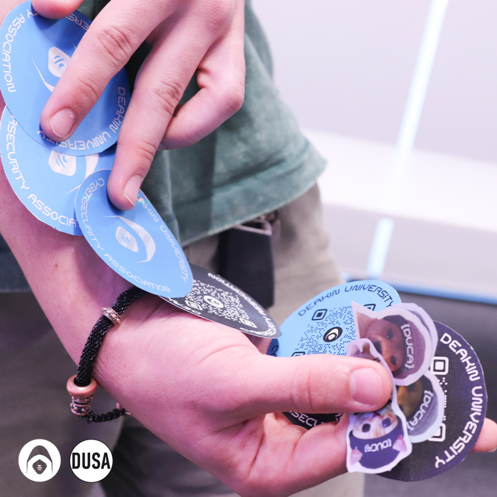
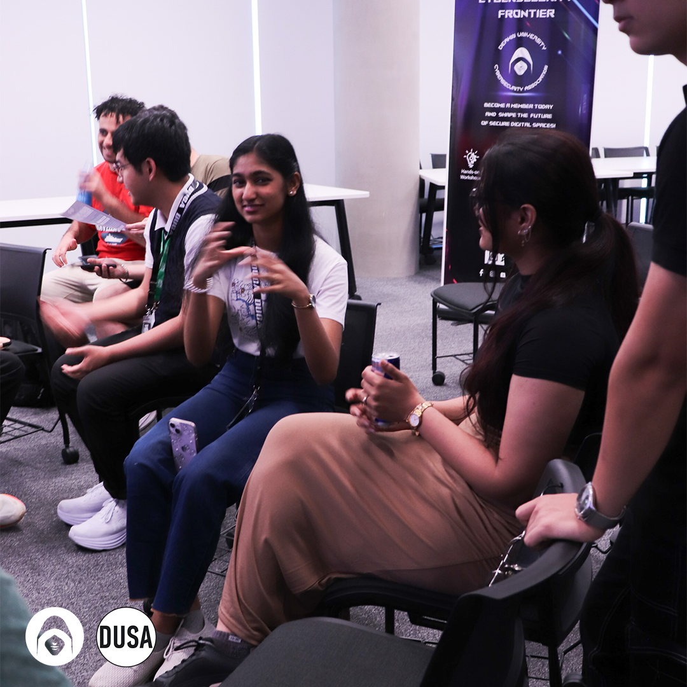
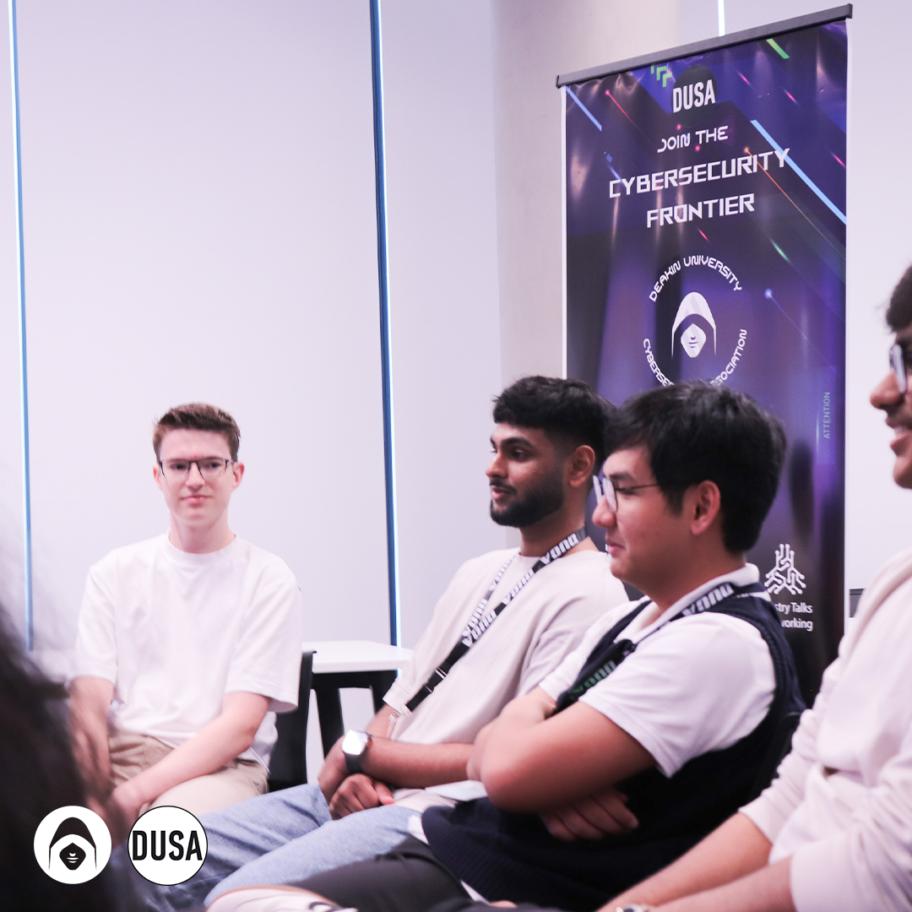
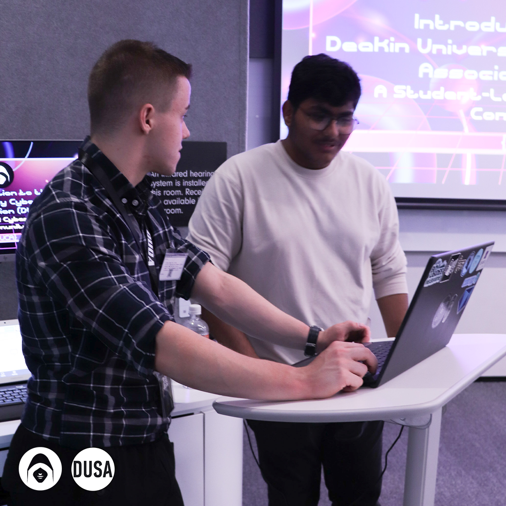

Last week, we held our very first event at Deakin, and we are still amazed by the incredible turnout. The enthusiasm, curiosity, and energy in the room made it clear that cybersecurity is a growing passion for many students. Seeing so many of you engage with our vision, meet our team, and learn about what we’re building was truly inspiring.

This event was just the beginning. We wanted to introduce not only who we are but also how DUCA (Deakin University Cybersecurity Association) is here to support students at every stage of their cybersecurity journey. Whether you’re just starting out or already deep into the field, our goal is to create a space where everyone can learn, grow, and find valuable opportunities.

#### What Happened at Our First Event?

Our launch event was designed to set the stage for what’s ahead. We introduced our four key divisions, which form the foundation of our activities:

- **Cyber Essentials**: Aimed at those who are new to cybersecurity, this division focuses on the fundamental concepts and best practices to build a strong foundation.
- **Capture The Flag (CTF) Challenges**: A hands-on, competitive way to sharpen your hacking and problem-solving skills while learning to think like a cybersecurity professional.
- **Penetration Testing**: For those interested in ethical hacking and security testing, this division explores how to identify vulnerabilities and defend against cyber threats.
- **Networking and Career Growth**: Cybersecurity is about more than just technical skills. Building connections with like-minded individuals and industry professionals is a key part of career success.

We designed these divisions to ensure that no matter what area of cybersecurity interests you, there is something valuable for you at DUCA.

Missed the Event? No Problem!

If you weren’t able to make it to our launch event, don’t worry. We host workshops every Friday, covering a wide range of topics to help you build your skills and stay ahead of the curve before graduation. Our workshops include:

- Cybersecurity fundamentals and best practices
- Hands-on Capture The Flag (CTF) challenges
- Penetration testing and ethical hacking techniques
- Career-focused networking opportunities

These sessions are a great way to gain practical experience, meet fellow cybersecurity enthusiasts, and learn from experts in the field.

In fact, we are thrilled to announce that we welcomed over 90 new members to the DUCA community this week alone! 🤯 It’s truly inspiring to see so many passionate individuals join our growing network of aspiring cyber professionals. Whether you’re just starting your journey or are already well on your way in the tech world, DUCA is the perfect place to connect with like-minded individuals, gain valuable insights, and take your cyber career to the next level.

#### For New Members: Your Exclusive O-Week Certificate is Coming Soon!

To all of you who signed up during O-Week — thank you again for your commitment to your cyber journey! As a special token of appreciation, we’ll be sending out a very exclusive O-Week Certificate to all our new members via email next week. 🎉 Not only is this certificate a great way to celebrate your first step in joining DUCA, but it’s also the perfect addition to your LinkedIn profile. 🚀 It shows future employers and connections that you’re serious about pursuing a career in cybersecurity and that you’re already taking active steps toward building your knowledge and network in the field.

If you’re looking for that extra bit of credibility to stand out in the competitive world of cyber, this certificate is a great way to showcase your commitment to growth. So, keep an eye on your inbox – it’s coming soon!

#### A Chance to Win Big

To make things even more exciting, we’re offering a special incentive for those who sign up with DUCA. For just $2 (if you’re a DUSA member), you’ll automatically be entered into a draw to win prizes worth up to $1200. It’s a great opportunity to join a thriving cybersecurity community while also having a chance to win something valuable.

#### What’s Next?

This is just the beginning, and we have a lot planned for the trimester ahead. From hands-on workshops and interactive challenges to networking events and industry insights, we’re working hard to bring engaging and valuable cybersecurity experiences to Deakin students.

To stay up to date with everything happening at DUCA, make sure you’re following us on social media and joining our Discord community. Our next event is coming up this Friday, so keep an eye out for the official announcement. We’re excited for what’s ahead and can’t wait to see you there.

