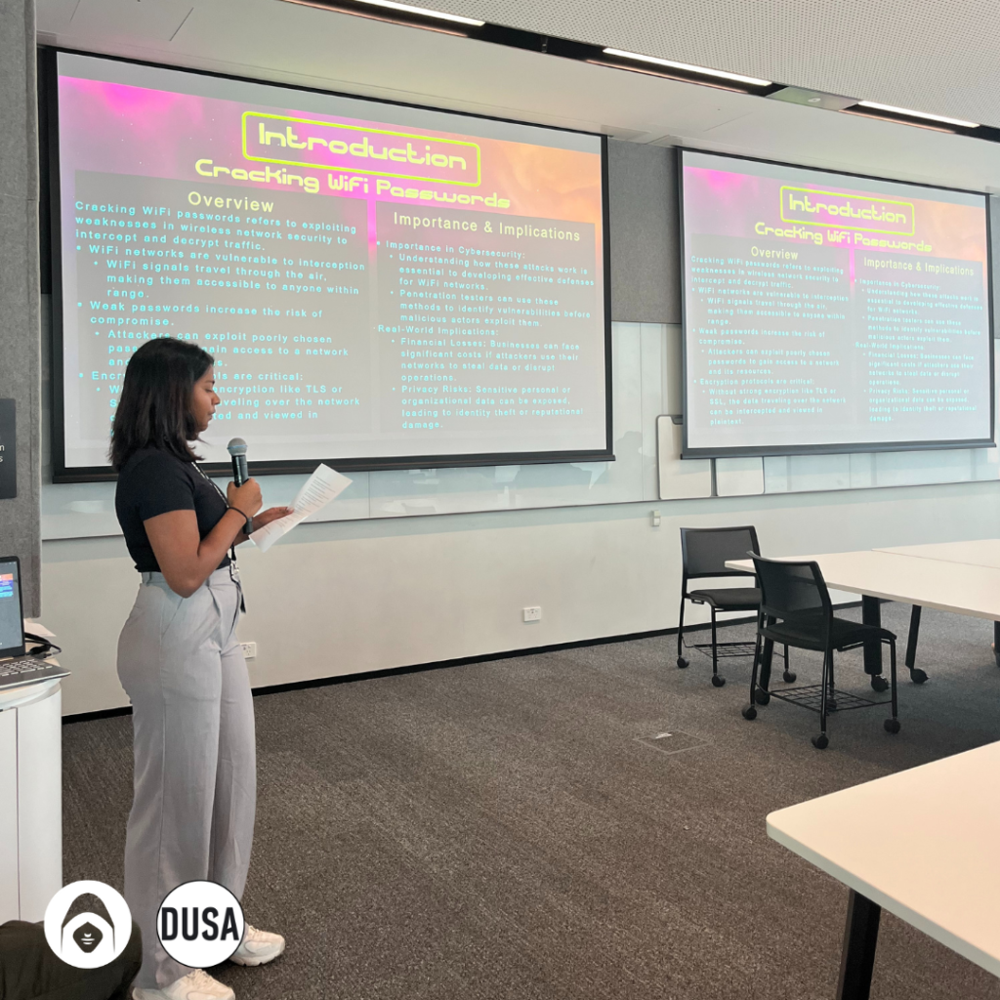
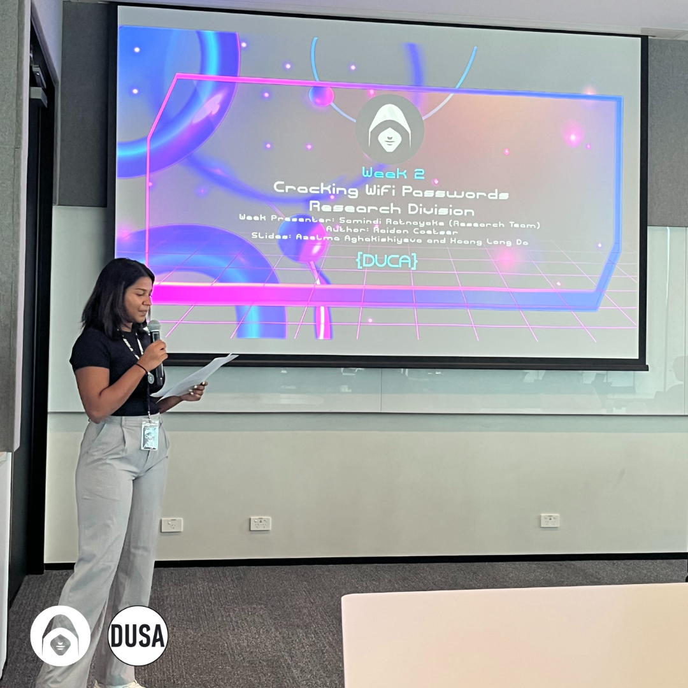

Last week’s lecture provided an in-depth look at Wi-Fi security and password cracking, a critical topic in cybersecurity. The session explored how wireless networks can be compromised, the role of encryption protocols in protecting data, and the ethical considerations surrounding penetration testing. By examining real-world attack techniques within a Capture The Flag (CTF) framework, we gained valuable insights into both offensive security tactics and best practices for defending wireless networks.

#### Ethical Considerations in Wi-Fi Cracking

A major takeaway from the lecture was the importance of ethical hacking principles when dealing with Wi-Fi security. In both professional penetration testing and CTF competitions, it is crucial to follow strict rules and legal guidelines. Unauthorised access to real-world networks is illegal, and in ethical hacking scenarios, only designated test environments should be used for security assessments.

One of the key ethical concerns discussed was brute-force attacks, which involve systematically guessing passwords to gain access to a network. While some CTF challenges allow brute-forcing within controlled environments, many competitions limit excessive password attempts through rate-limiting mechanisms. This reflects real-world security measures designed to prevent unauthorised access and protect against brute-force attacks.

Additionally, the lecture emphasised responsible disclosure—if a participant discovers a real vulnerability while working on a CTF challenge, they should report it through official security channels instead of exploiting it. This aligns with professional ethical hacking standards followed by penetration testers and security researchers.

#### Wi-Fi Cracking Techniques Explored

The session introduced various techniques used to crack Wi-Fi passwords and analyse wireless security vulnerabilities. Some of the key attack methods we covered included:

- **Packet Sniffing**: Capturing and analysing network traffic to gather information about connected devices and encryption protocols.
- **Deauthentication Attacks**: Forcing a device to disconnect from a Wi-Fi network, allowing an attacker to capture the handshake process during reconnection.
- **Dictionary and Brute-Force Attacks**: Using precompiled lists of commonly used passwords or systematically trying different combinations to crack a Wi-Fi key.
- **Exploiting Weak Encryption**: Attacking outdated security protocols such as WEP (Wired Equivalent Privacy), which is vulnerable to key recovery attacks, or poorly configured WPA/WPA2 networks.

By understanding these attack methods, cybersecurity professionals can develop stronger defenses against real-world threats.

#### Wi-Fi Encryption Protocols and Their Importance

One of the primary defenses against Wi-Fi cracking is the use of strong encryption protocols. The lecture covered the evolution of wireless security standards, highlighting the weaknesses and strengths of different encryption methods:

- **WEP (Wired Equivalent Privacy)**: One of the earliest Wi-Fi encryption protocols, but now considered completely insecure due to vulnerabilities in its key scheduling algorithm.
- **WPA (Wi-Fi Protected Access)**: An improvement over WEP but still susceptible to brute-force attacks and other exploits.
- **WPA2 (Wi-Fi Protected Access 2)**: The most widely used standard today, offering stronger security through AES (Advanced Encryption Standard) encryption. However, WPA2 can still be vulnerable if weak passwords are used.
- **WPA3**: The latest and most secure version, providing enhanced protection against brute-force attacks and improved encryption techniques.

Understanding these encryption protocols allows security professionals to recommend and implement stronger security measures to protect wireless networks.

#### Best Practices for Securing Wi-Fi Networks

The lecture also outlined essential security best practices to mitigate the risk of Wi-Fi attacks. Some key recommendations included:

- Using strong, unique passwords that are resistant to dictionary attacks.
- Disabling WPS (Wi-Fi Protected Setup) to prevent brute-force attacks exploiting weak PIN authentication.
- Enabling MAC address filtering to control which devices can connect to a network.
- Regularly updating router firmware to patch security vulnerabilities.
- Monitoring network activity for unauthorised access attempts.

These strategies help ensure that Wi-Fi networks remain secure against potential attackers.

#### Final Thoughts

The lecture provided a valuable introduction to Wi-Fi cracking techniques and wireless security, helping us understand both offensive attack methods and defensive security strategies. While CTF challenges offer a safe environment for ethical hacking practice, the key takeaway was that Wi-Fi security is a critical issue in real-world cybersecurity. By applying ethical principles and best practices, security professionals can help protect wireless networks from threats and vulnerabilities.
