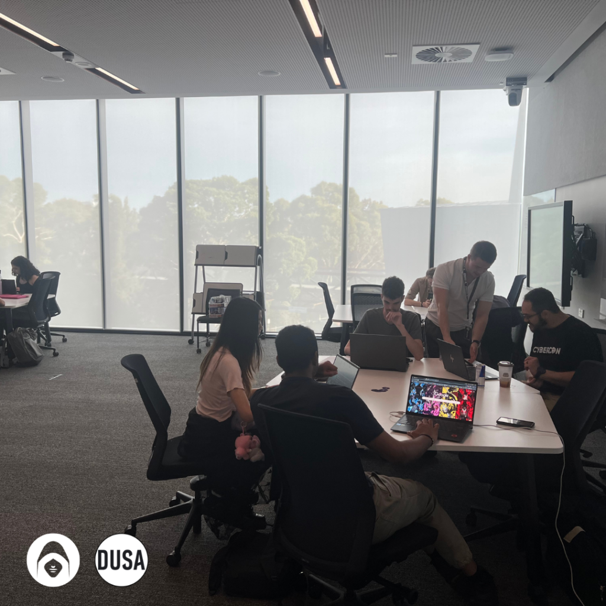
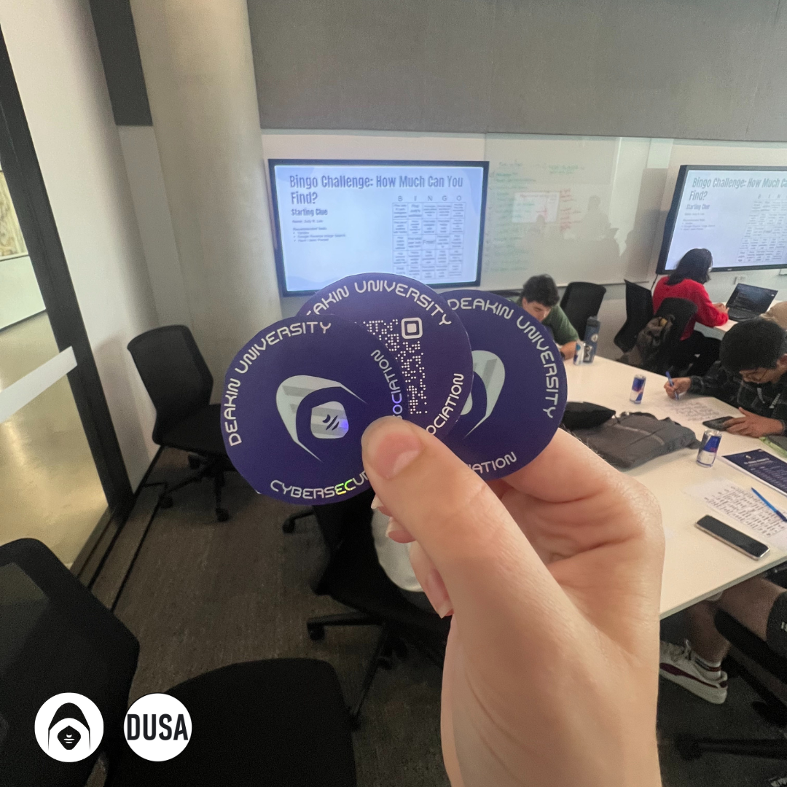

Last week’s lecture provided a comprehensive introduction to Capture The Flag (CTF) competitions, an essential learning tool in the cybersecurity field. While many think of hacking challenges as purely technical exercises, CTFs are structured competitions that teach problem-solving, teamwork, and ethical considerations in security research. The session emphasised how CTFs help develop skills in areas such as vulnerability research, digital forensics, and penetration testing. However, it was also made clear that excelling in CTFs does not automatically equate to real-world experience, though it can serve as a stepping stone into cybersecurity careers.

### The Importance of Rules and Ethical Boundaries

A key part of any CTF competition is understanding and following the rules. The lecture highlighted that in professional and competitive settings, hacking outside of defined parameters is not only unethical but could have serious legal consequences. One of the most fundamental rules is to only target designated systems—attacking external infrastructure, even accidentally, is strictly prohibited.

Another important rule concerns brute-forcing, a technique used to systematically guess passwords or encryption keys. Some CTFs allow this but impose restrictions such as rate limits or automatic IP blocking to prevent excessive server load. Additionally, knowing the flag format is crucial, as some challenges require specific syntax when submitting solutions.

The lecture also stressed responsible disclosure. If participants discover a real vulnerability while working on a CTF challenge, they should report it through official channels rather than exploit it. This aligns with the ethical standards followed by professional security researchers and penetration testers.

### Jeopardy-Style CTF Challenges and Their Applications

The session covered five main categories of Jeopardy-style CTF challenges, each focusing on a different aspect of cybersecurity. These challenges mimic real-world security problems and are commonly found in professional security assessments.

#### Binary Exploitation

Binary exploitation challenges require participants to analyse an application’s binary and source code to uncover vulnerabilities. This often involves understanding memory management issues such as race conditions, buffer overflows, and uninitialised variables.

Learning how applications handle memory is crucial for vulnerability research and exploit development. Many professional penetration testers and bug bounty hunters use these techniques to assess software security. Careers related to this field include penetration testing, vulnerability research, and exploit development.

#### Cryptography

Cryptography challenges test the ability to decrypt ciphertext to find a hidden flag or extract clues. Participants are often given encrypted data and must determine which encryption algorithm was used and how to reverse it. The lecture emphasised that while these challenges help in recognising common encryption methods, they do not directly translate to being able to decrypt real-world ransomware or advanced encryption schemes.

Understanding cryptography is essential for anyone pursuing a career in security research, cryptanalysis, or secure software development. However, it requires deep knowledge beyond what can be learned in CTFs alone.

#### Digital Forensics

Digital forensics challenges involve recovering hidden information from digital evidence such as disk images, memory dumps, or network packet captures. This category teaches techniques for uncovering data that might have been deleted, concealed, or obfuscated using counter-forensic methods.

This field is particularly relevant to incident response, threat intelligence, and forensic investigations, where cybersecurity professionals analyse attack patterns and gather digital evidence for legal or security purposes. Careers in this domain include forensic analyst, SOC analyst, and threat intelligence specialist.

#### Reverse Engineering

Reverse engineering challenges require analysing a binary or source code to extract a hidden flag. This typically involves debugging, decompiling, and understanding how the program executes to identify weaknesses or embedded secrets.

This skill is especially valuable in malware analysis and exploit development, where analysts study malicious software to determine its behavior and identify indicators of compromise. Many security professionals working in rule development and digital forensics rely on reverse engineering to detect and mitigate threats.

#### Web Exploitation

Web exploitation challenges focus on compromising a web application to retrieve a flag. The vulnerabilities targeted in these challenges often include SQL injection, cross-site scripting (XSS), and server misconfigurations.

Understanding web security is critical because web applications are among the most frequently attacked systems. Many security researchers specialise in bug bounty programs, penetration testing, and web security analysis, applying similar skills in real-world vulnerability assessments.

### CTFs as a Learning Tool, Not a Shortcut to Expertise

One of the most important messages from the lecture was that CTFs are excellent for skill-building but do not replace real-world security experience. While CTFs teach technical concepts, actual cybersecurity work involves collaboration, report writing, understanding business risks, and working within structured environments.

That said, many professionals use CTFs as a way to practice problem-solving, experiment with security tools, and explore new techniques in a controlled environment. For those interested in developing their skills further, participating in events such as DUCA’s CTF series in T1 and T2 can provide valuable hands-on experience.

### Final Thoughts

The lecture provided an insightful overview of how CTF competitions work and how they relate to real-world cybersecurity. The discussion of ethical hacking rules reinforced the importance of responsible security practices, while the breakdown of challenge categories helped us understand the different career paths associated with each skill set.

CTFs are a valuable learning tool, but success in cybersecurity requires continuous effort, patience, and real-world application of these skills. As the saying goes, Rome wasn’t built in a day—and neither is a cybersecurity expert.

DUCA holds events every Friday between 5-7PM in LC2.105 at Deakin University Burwood. Event announcement coming soon!
