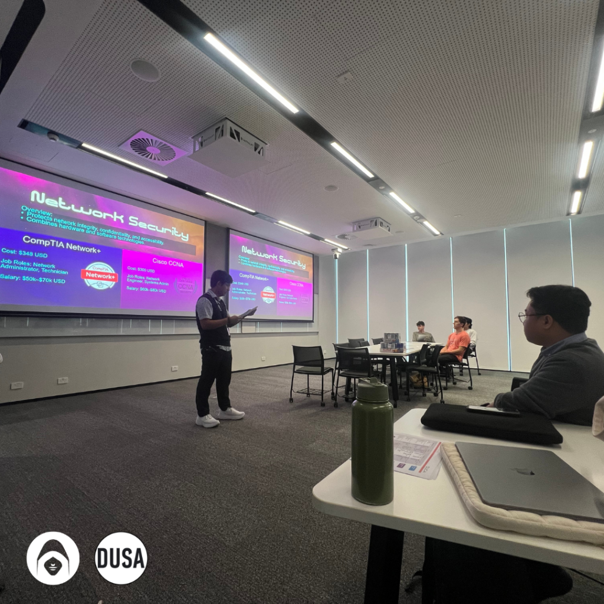
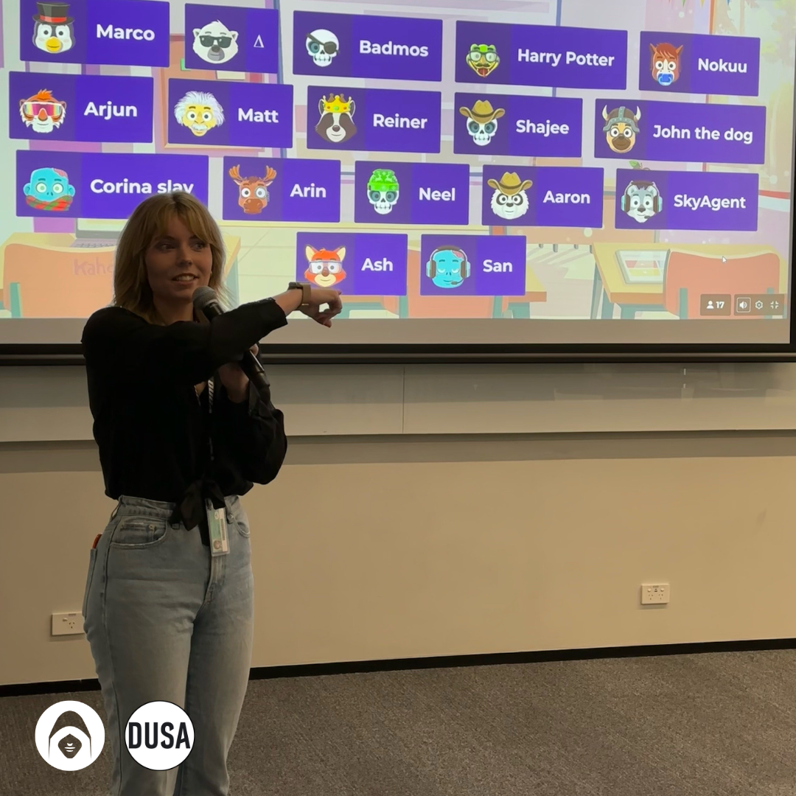
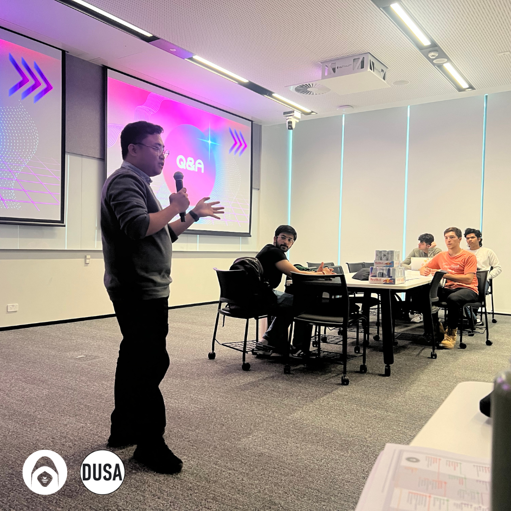
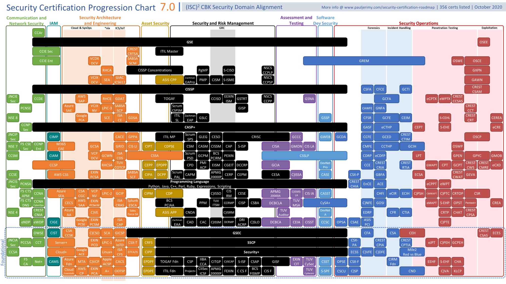

In an age where digital transformation touches nearly every aspect of our daily lives, cybersecurity has become a critical pillar in ensuring the integrity, confidentiality, and availability of data. The rapid rise in cyber threats has created an urgent demand for skilled individuals who can protect against increasingly sophisticated attacks. However, for students and recent graduates entering this dynamic field, the road ahead can seem daunting. With the broad scope of cybersecurity, defining a clear career path can often feel overwhelming, especially when there is no single “cybersecurity role.” Instead, the industry is divided into numerous specialisations such as Network Security, Penetration Testing, Cloud Security, and many others.

Our recent event aimed to shed light on these pathways and provide aspiring cybersecurity professionals with the resources to navigate this complex landscape. By highlighting the different career tracks and certification options available, we sought to empower individuals to align their education, credentials, and career ambitions with the rapidly evolving needs of the cybersecurity sector. In this post, we reflect on the key takeaways from the event and share insights that can help anyone interested in pursuing a career in cybersecurity.

#### Understanding Cybersecurity’s Broad Scope

As we discussed during the event, cybersecurity is not a one-size-fits-all field. It encompasses multiple specialisations, each with its own set of skills, knowledge, and certifications. These specialisations range from Network Security, Information Security, Ethical Hacking, Cloud Security, to Digital Forensics and beyond. We explored the unique aspects of these areas, explaining how they contribute to the broader mission of defending against cyber threats.

For instance, **Network Security** is the first line of defense against cyberattacks and involves safeguarding the integrity of computer networks using both hardware and software technologies. Certifications such as **CompTIA Network+** and **Cisco Certified Network Associate (CCNA)** are key for those interested in network infrastructure and administration. On the other hand, **Information Security** professionals focus on protecting sensitive data from unauthorised access, making certifications like **CompTIA Security+** and **(ISC)² Systems Security Certified Practitioner (SSCP)** critical for those aiming to specialise in this domain.

#### Career Pathways and Certification Roadmap

During the event, we made it clear that cybersecurity is an expansive field that allows individuals to carve out their niche. Whether you’re interested in **Ethical Hacking** with certifications like **Certified Ethical Hacker (CEH)** or **Offensive Security Certified Professional (OSCP)**, or you’re more inclined toward **Cloud Security**, certifications like **AWS Certified Security Specialty** and **Certificate of Cloud Security Knowledge (CCSK)** open doors to exciting opportunities in cloud-based environments.

A key highlight of the event was emphasising the importance of aligning one’s career goals with the appropriate certification track. For individuals just starting out, we recommended beginning with foundational certifications like **CompTIA A+** and **CompTIA Network+**. These certifications establish a strong base of knowledge in hardware, software, and network fundamentals. As attendees advanced in their careers, we suggested progressing to more specialised certifications based on personal interests—whether that’s diving deeper into network security, ethical hacking, or cloud computing.

Moreover, we addressed the necessity of experience for higher-level certifications. For example, advanced certifications such as **Certified Information Systems Security Professional (CISSP)** and **Certified Information Security Manager (CISM)** require years of work experience, but they offer significant career rewards, with opportunities in leadership and management roles.

#### Real-World Impact: Empowering Career Decisions

The discussions at the event revolved around making informed decisions about career paths in cybersecurity. We presented real-world salary ranges for each specialisation, allowing attendees to gain a better understanding of the financial prospects tied to different roles. For example, salaries for roles like **Penetration Tester** and **Ethical Hacker** can range from $75,000 to $110,000 annually, while those specialising in **Cloud Security** can expect salaries from $90,000 to $140,000 annually.

This information provided attendees with a clear view of the industry’s financial rewards and helped them understand how the right certifications could directly influence their career trajectory. It became evident that, in addition to technical expertise, strategic certifications are key to climbing the cybersecurity career ladder.

#### The Importance of Lifelong Learning

One of the key messages we emphasised during the event was the importance of **lifelong learning**. Cybersecurity is a rapidly evolving field, and staying updated on the latest trends, tools, and threats is essential. Certifications aren’t just a one-time accomplishment but an ongoing commitment to continuous education. Many certifications, such as **CompTIA Security+** and **Cisco CCNA**, are valid for only a few years, requiring professionals to renew them through continuing education or additional training. This ensures that cybersecurity professionals remain at the forefront of the industry, ready to tackle new challenges as they emerge.

#### A Bright Future in Cybersecurity

Our event was a resounding success, bringing together students, recent graduates, and professionals eager to learn more about pursuing careers in cybersecurity. By offering a deep dive into the various disciplines and certifications available, we were able to demystify the pathways in cybersecurity, helping attendees make more informed decisions about their careers. With the right education, experience, and certifications, the future for those entering this field is incredibly bright.

We hope that those who attended the event left feeling empowered to pursue their cybersecurity ambitions with confidence, equipped with the knowledge to navigate the many options at their disposal. As cybersecurity continues to play a pivotal role in safeguarding the digital world, the next generation of professionals will be the ones leading the charge.

If you’re interested in further exploring a career in cybersecurity, we encourage you to stay curious, seek out relevant certifications, and continuously learn to stay ahead of emerging trends. For more information, consult the following certifications roadmap guideline.

