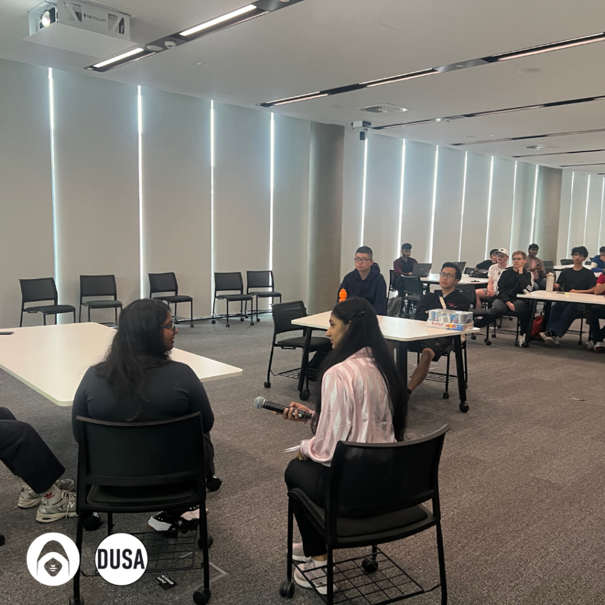
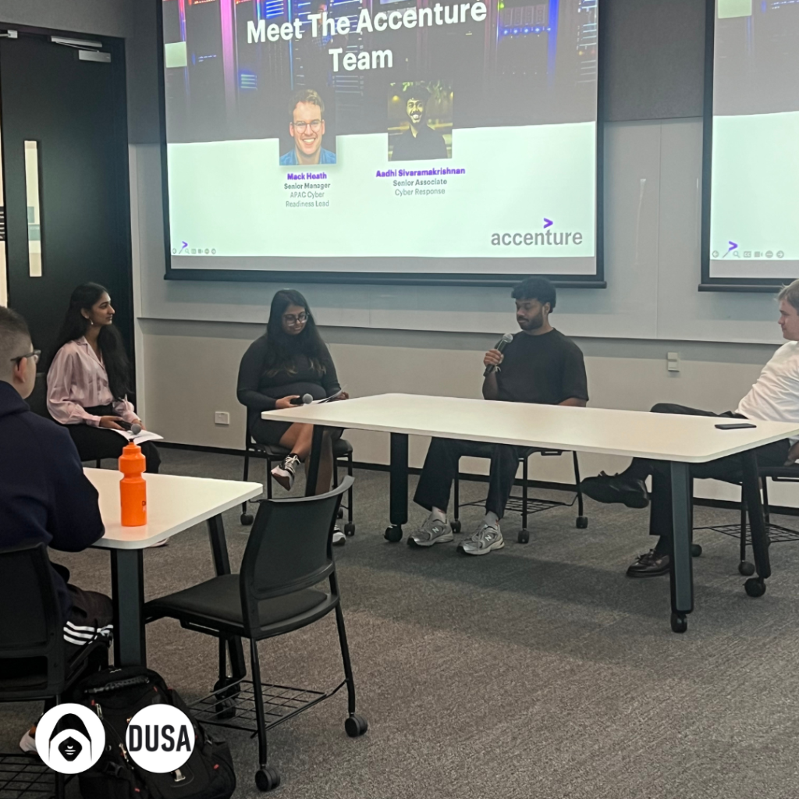

This week, DUCA members had the privilege of hearing from two exceptional individuals who shared their diverse experiences in the field of cybersecurity. Mack Heath, the APAC Cyber Proactive and Readiness Services Lead at Accenture, offered insights into security operations and leadership across the APAC region. Additionally, Aadhi Sivaramakrishnan, a Senior Associate at Accenture and master’s student at Deakin University, provided a unique perspective from an academic standpoint, offering valuable reflections on the intersection of academic learning and real-world cybersecurity challenges.

#### How to Navigate the Transition from University to Industry

Mack’s advice on transitioning from university to industry resonated with many of us as students. While technical knowledge is a strong foundation, he highlighted the importance of soft skills like communication, leadership, and exploring as many different skills as possible. As students, it’s important to not only focus on mastering technical skills but also prepare for the business environment in which those skills will be applied.

#### How to Choose Certifications Wisely

Mack’s journey through certifications like GIAC Defensible Security Architecture (GDSA) and GIAC Enterprise Incident Response (GEIR) provided clarity on the value of certifications in cybersecurity, especially for  the specific area each student wants to transition into. He stressed the importance of choosing certifications based on one’s career goals such as specialising in specific areas like cloud security.

#### Career Progression: From Technical Contributor to Leadership

Mack shared his own career trajectory from a Security Engineer at Amazon to his current leadership position at Accenture. His transition from an individual contributor to managing large-scale security initiatives across the APAC region offered us a roadmap of how to develop both technical and leadership skills. His experience highlighted the importance of strategic planning, leadership, and the ability to balance business requirements with security needs.

#### Emerging Cybersecurity Trends

As the cybersecurity field rapidly evolves, Mack provided valuable insights into emerging trends. He pointed out the growing significance of cloud security and even space security (Yes, in outer space!) His reflections on regional security challenges, particularly in the APAC region, broadened our understanding of global cybersecurity practices.

#### The Value of Hands-On Experience

Mack emphasised the importance of hands-on learning through activities like Capture the Flag (CTF) competitions and bug bounty programs. For students, this advice was a clear call to start building practical skills and real-world experience, which will be crucial when entering the cybersecurity workforce.

#### Key Insights from Aadhi Sivaramakrishnan

Aadhi, as a master’s student at Deakin University, also shared valuable insights from his academic journey. His perspective on bridging the gap between university learning and industry practice was particularly insightful for those of us still navigating the theoretical aspects of cybersecurity.

#### The Role of University Education in Cybersecurity Careers

Aadhi spoke about how coursework at Deakin University has shaped his understanding of both technical and theoretical aspects of the field as well as the ways he expanded upon this outside of university studies. His experience reinforced the importance of applying classroom knowledge to real-world scenarios, encouraging fellow students to seek out opportunities to integrate learning with practical experience.

#### Staying Current with Industry Trends

Aadhi highlighted the rapid pace at which the cybersecurity landscape evolves, urging students to continuously update their knowledge and stay informed about emerging technologies, tools, and techniques. This aligns with Mack’s advice about proactive learning and adapting to new challenges, ensuring that we remain prepared for the evolving demands of the field.

#### Embracing the Cybersecurity Journey

This amazing networking session with Mack Heath and Aadhi Sivaramakrishnan was an incredibly valuable opportunity for DUCA members to gain insights from two professionals with distinct but complementary perspectives. While Mack provided leadership-focused guidance drawn from his vast industry experience, Aadhi offered a student-centric perspective, reminding us of the importance of aligning academic learning with professional growth.

For those of us still navigating our educational journey, the combined insights from both speakers were a reminder of the multifaceted nature of cybersecurity careers. It’s not only about technical skills but also about developing leadership, mentorship, and the ability to collaborate across disciplines.

A big thank you to Mack and Aadhi for sharing their knowledge and experiences. We left the event feeling inspired, informed, and better prepared for our futures in cybersecurity.

