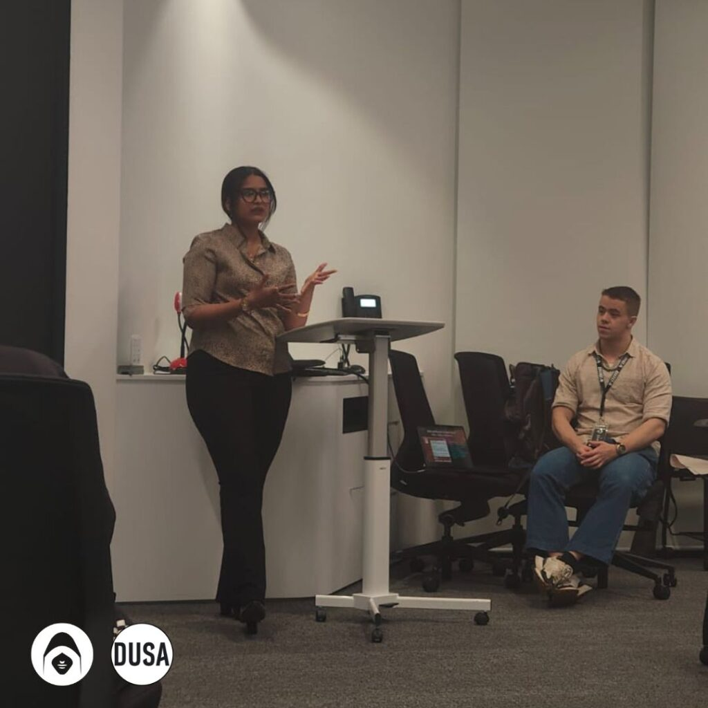
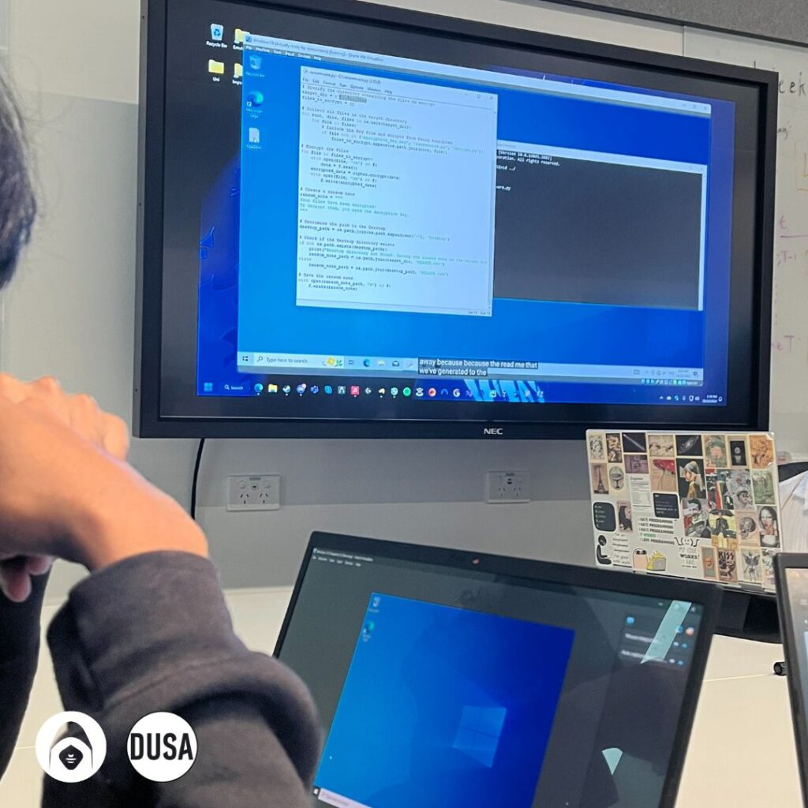
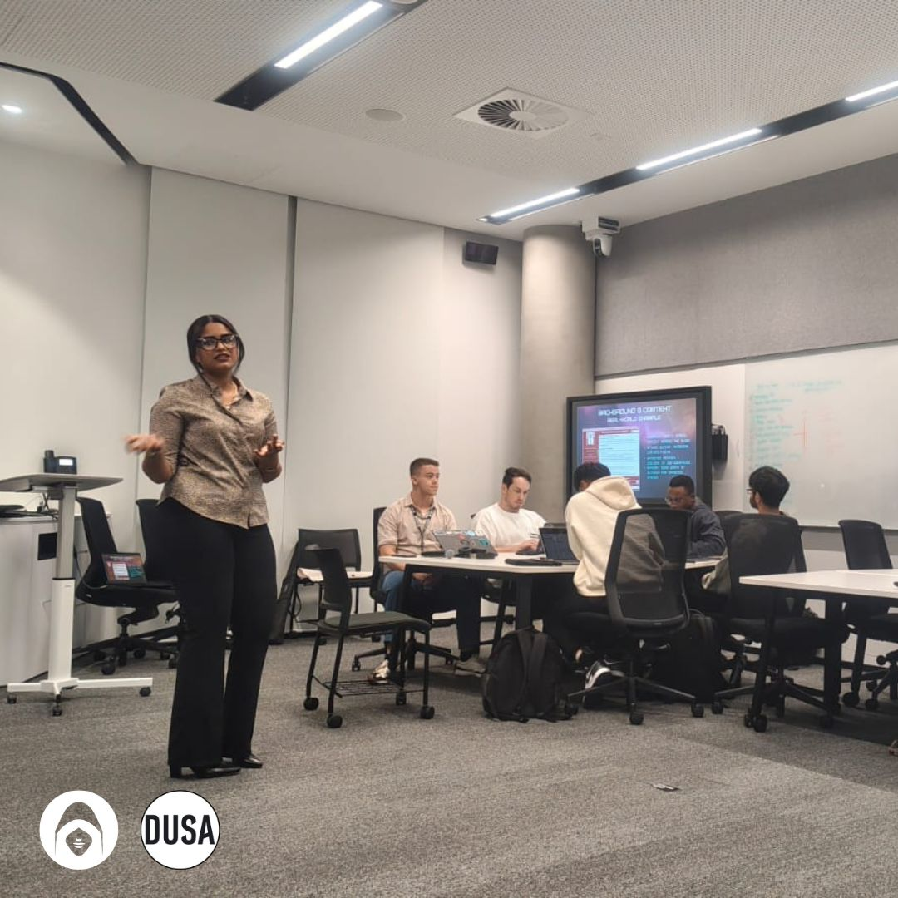

Ransomware represents a significant and escalating threat in today’s digital landscape. It’s a form of malicious software that encrypts files or blocks access to systems until a ransom is paid—typically in cryptocurrency. Over recent years, ransomware attacks have evolved in complexity and scale, targeting not just individuals, but businesses and governments, too.

To help demystify the threat, we hosted a hands-on ransomware simulation in a safe virtual environment. This gave attendees the chance to see exactly how ransomware operates—from infection to encryption—and how cybersecurity professionals prepare and respond.

The simulation wasn’t just about tech. It was about showing how fast things can spiral, and why even basic defences can make a major difference. When people experience a cyber threat firsthand, it shifts the conversation from theory to action.

#### Tools, Tactics, and Takeaways

To keep things controlled and secure, we used VirtualBox to run a Windows 10 virtual machine isolated from our real systems. The ransomware script itself was built using Python, powered by the Cryptography library. With a few lines of code, we created a realistic example that encrypted a folder of files and generated a ransom note.

The script mimicked typical ransomware behaviour: scanning for specific file types, encrypting them using symmetric keys, and replacing them with unreadable versions. While simplified, it reflected the core mechanics used in real attacks like WannaCry and Ryuk.

What made this impactful wasn’t just the encryption—it was how fast and silently it unfolded. Participants could see how an attacker doesn’t need advanced tools to cause chaos. And once files are encrypted, it’s game over unless you have backups or a decryption key.

We also discussed how ransomware often enters through phishing emails, malicious attachments, or unpatched software. From there, it may spread laterally across a network, use legitimate tools like PowerShell to mask its actions, and sometimes even exfiltrate data for double extortion.

#### Lessons from Real-World Cases

To highlight the real-world stakes, we explored some of the most notorious ransomware incidents:

- **WannaCry (2017)** paralysed systems worldwide, including hospitals.
- **NotPetya** looked like ransomware but was actually destructive wiper malware.
- **Ryuk** targeted high-value organisations with ransom demands in the millions.
- **The Colonial Pipeline attack (2021)** showed how ransomware could disrupt national infrastructure.
- **Healthcare sector attacks during COVID-19** had real human impact, delaying patient care and risking lives.
    
Each of these events revealed how ransomware isn’t just an IT issue—it’s a business risk, a public safety concern, and in some cases, a national security threat.

#### Preparing for Reality: Defence and Recovery

One of the key takeaways from our simulation was the importance of preparation. Prevention remains the most effective defence. This includes:

- Regular software updates and patching
- Security awareness training, especially around phishing
- Least-privilege access controls and network segmentation
- Frequent, offline backups with recovery plans in place

We also touched on incident response—what happens when prevention fails. From isolating infected machines to reporting the breach and managing public communication, a strong response plan can limit damage and restore trust.

We made it clear: **paying the ransom isn’t a solution.** It doesn’t guarantee data recovery, and it fuels the ransomware economy. Recovery should focus on preparedness, resilience, and containment—not negotiation.

#### Final Thoughts

Our ransomware simulation wasn’t just a technical demo—it was a wake-up call. Seeing the mechanics in action gave participants a deeper appreciation for how these attacks unfold and how quickly they can cause damage. But it also highlighted something more hopeful: how knowledge, good habits, and simple precautions can tip the balance in your favour.

In a world where ransomware is becoming more sophisticated and widespread, experiences like this are vital for building a new generation of defenders. With awareness, curiosity, and action, we can shift from reactive to proactive—turning one of cybersecurity’s biggest threats into a teachable moment.

