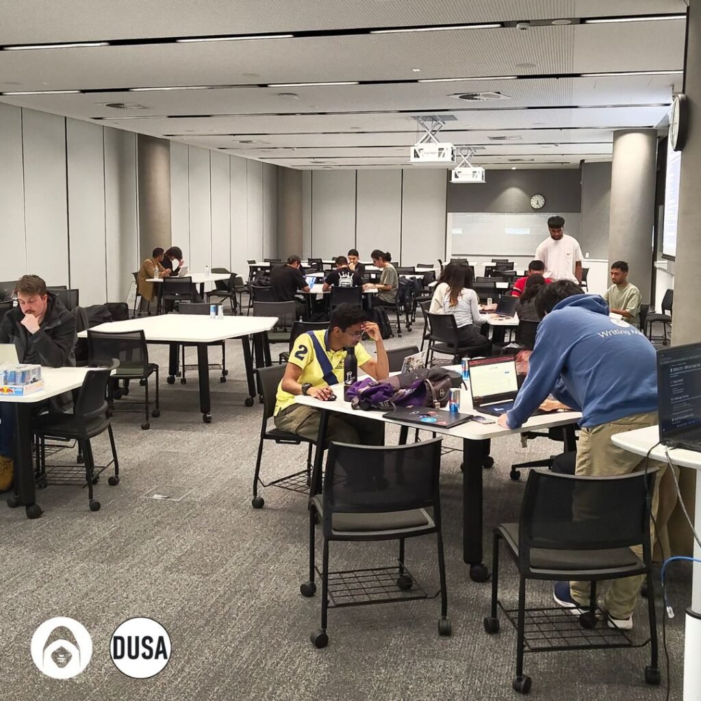
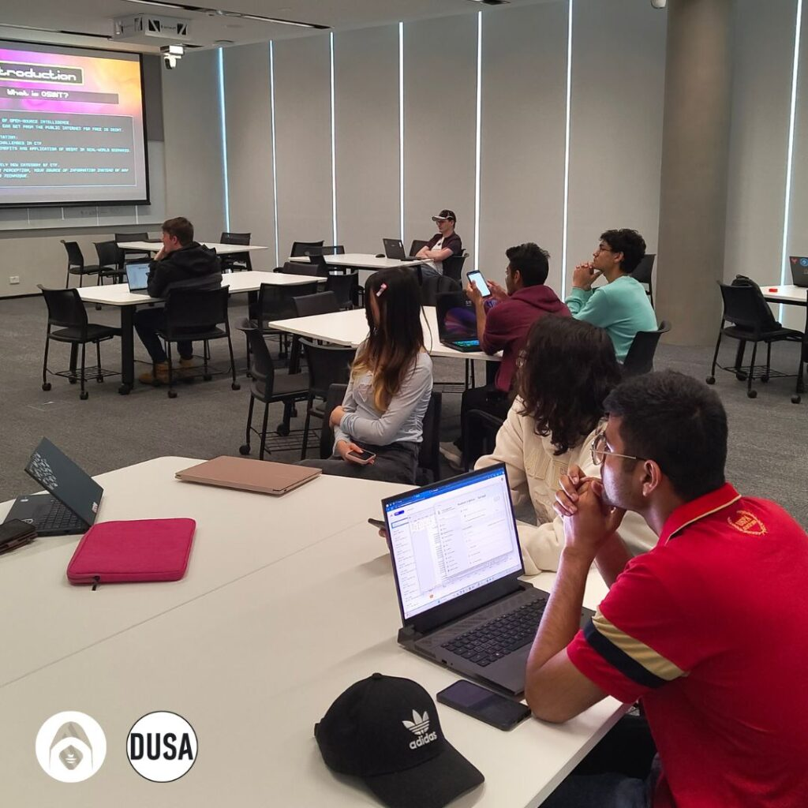
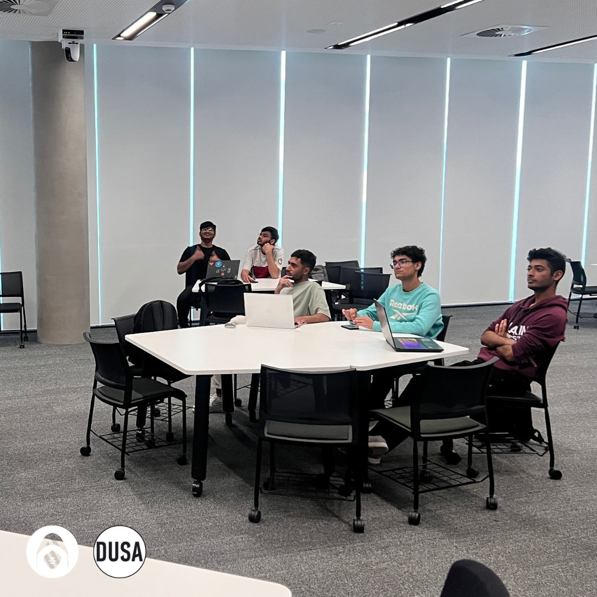
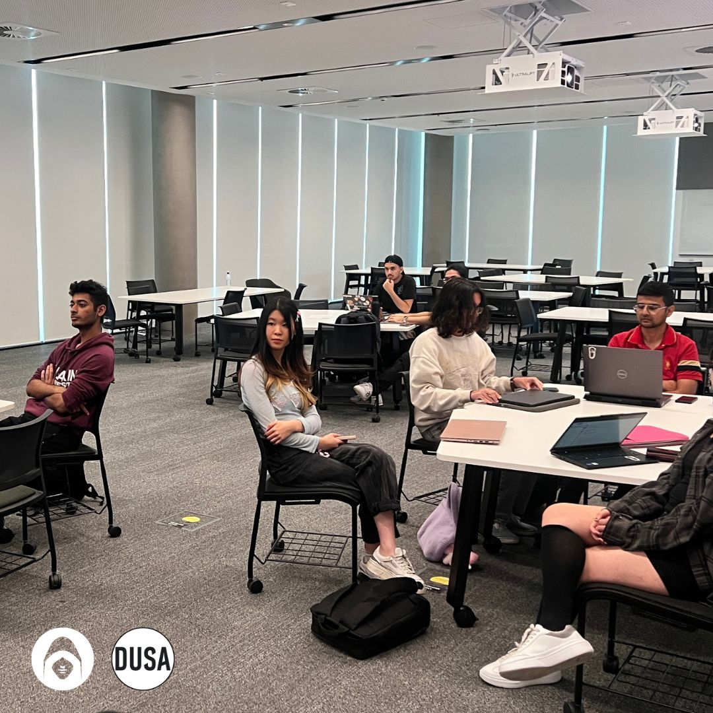

Recently, the Deakin University Cybersecurity Association hosted an OSINT-focused Capture The Flag (CTF) event, where participants were challenged to solve three progressively difficult tasks using open-source intelligence techniques.

From examining hidden image data to tracing digital breadcrumbs across the internet, the event aimed to build practical skills in information gathering, critical thinking, and investigative research. Here’s a recap of what the event looked like — and what we took away from it.

#### Challenge 1: “Eyes Can Be Deceiving”

The first challenge was designed to ease participants into the world of OSINT. They were given an image — a well-known photo of the Sydney Opera House — and asked to find the flag hidden inside it.

The trick? The flag wasn’t in the image itself, but in its **metadata**. Using a tool like **ExifTool**, participants were able to extract embedded information stored within the file — specifically, the “location” field, which had been quietly modified to contain the flag.

This challenge highlighted an important concept: files often carry more information than they appear to. Metadata, often overlooked, can include timestamps, locations, and even device information. Understanding how to access and interpret that data is a core skill in digital investigations.

#### Challenge 2: “Google Dork”

The second challenge was more research-focused and required a bit of clever Googling. The scenario involved a phishing campaign from 2016 and a suspicious email attachment — a PDF that had been referenced in a public CISA advisory.

Participants had to track down that report, follow its references, and identify the **MD5 hash** of the malicious file that had been analysed on VirusTotal. The clues were subtle — including a deliberately misspelled “invoic” — but they were all pointing toward real, publicly available documentation.

This challenge reinforced the value of **Google Dorking** and keyword precision. It was a reminder that not all cybersecurity challenges require technical exploitation — sometimes, it’s about knowing how to navigate public information effectively and follow a logical thread.

#### Challenge 3: “Where Am I?”

The final challenge — and the most difficult — offered only an image, with no supporting text or metadata. Participants were tasked with identifying the exact **suburb** where the photo had been taken.

There were no famous landmarks, but subtle clues were present: a shark statue, flags in the background, and a few seabirds. Using tools like **Google Lens**, reverse image search, and plain observation, participants had to cross-reference what they saw with known public locations.

The correct answer was **Laurieton**, a coastal suburb in New South Wales. While the tools used weren’t complex, the challenge required time, patience, and careful attention to detail — a true test of open-source investigation skills.

#### Why OSINT Matters

Across all three challenges, one theme stood out: **OSINT is about more than just tools — it’s about thinking critically and looking deeper**. Whether it’s examining file properties, searching for historical malware reports, or identifying subtle location markers in a photo, OSINT challenges train participants to question what’s in front of them and to explore the “hidden layers” of digital information.

It also reminded us that technical complexity doesn’t always equal difficulty. Some of the most powerful skills in cybersecurity are rooted in curiosity, research ability, and a strong understanding of where and how to find information.

#### Final Thoughts

Thank you to everyone who participated in the event — your engagement, collaboration, and persistence made it a great success. We hope the challenges gave you new insight into the world of OSINT and helped sharpen your problem-solving skills.

We’re looking forward to running more CTF events soon, with new challenges and opportunities to test your skills.

