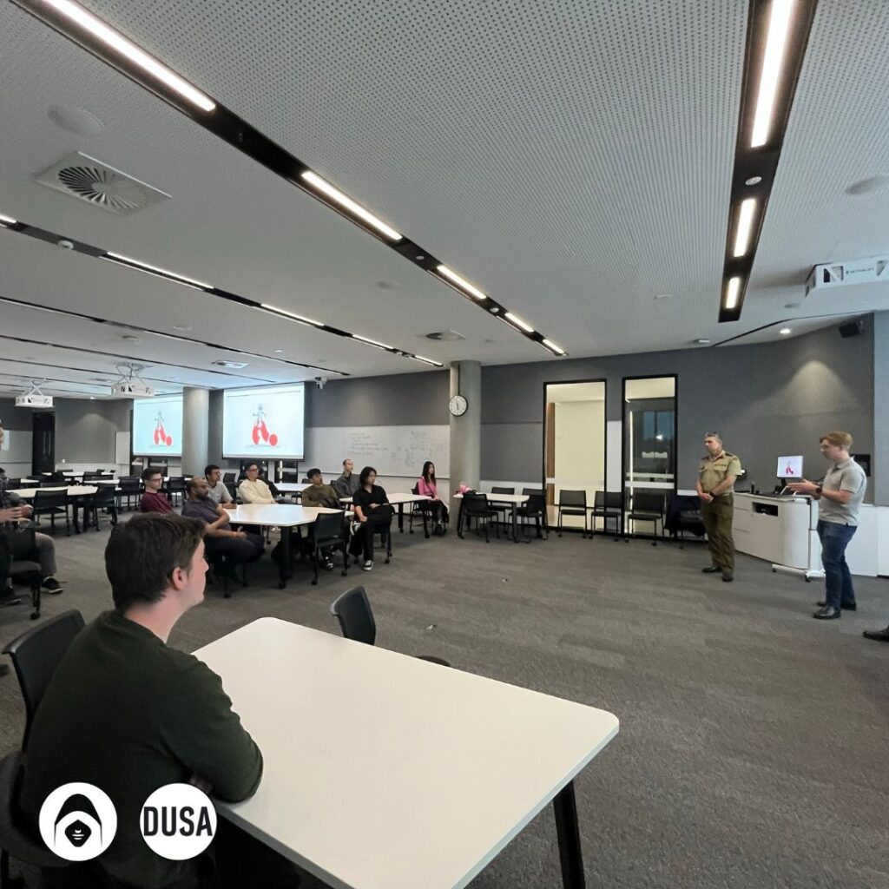
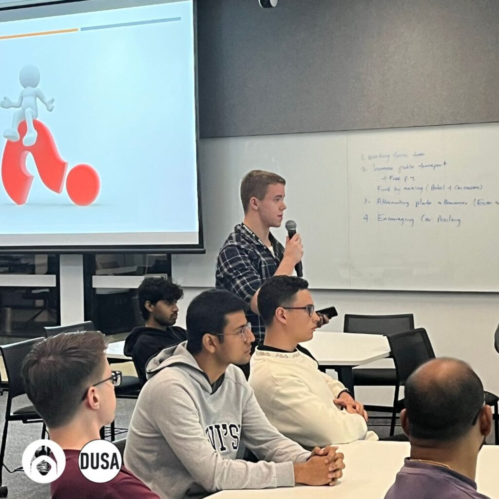
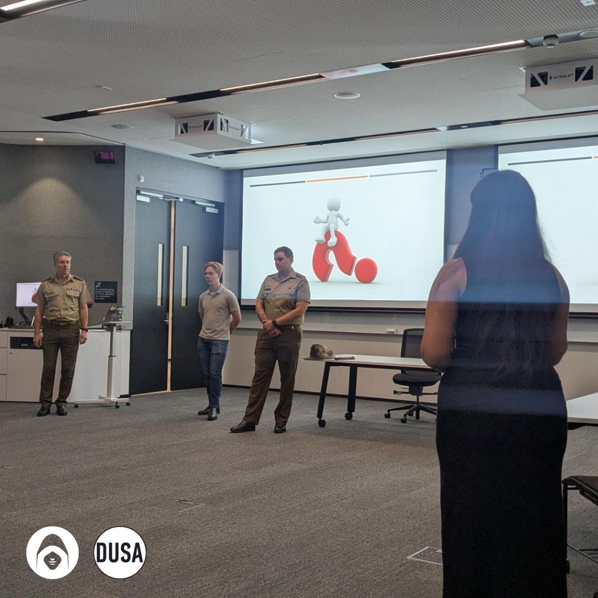
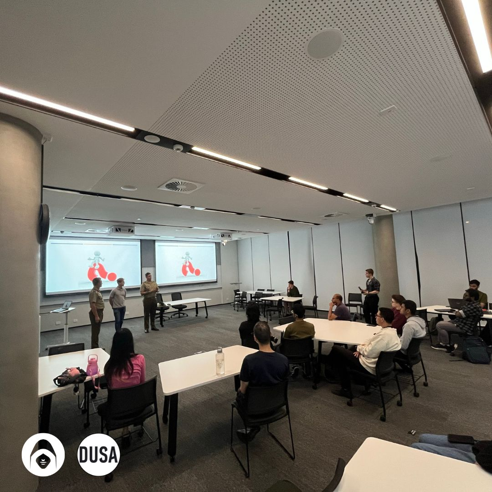

As we pause to reflect on ANZAC Day, a time when we honour the courage, sacrifice, and service of all Australian and New Zealand defence personnel—past and present—we are reminded of the immense dedication behind the uniform. This year, our reflections were even more meaningful as we had the opportunity to host a special event with distinguished members of the Australian Defence Force (ADF).

Colonel John Molnar, Captain Dan Lever, and Elliot Parker, a Cyber Warfare Officer, shared their invaluable experiences and insights with us, offering a deep dive into what life is truly like within the ADF, the future of defence, and the growing role of cybersecurity in national security.

#### Life in the ADF: Culture and Commitment

One of the most powerful takeaways from the session was the deep sense of camaraderie and culture within the ADF. Colonel Molnar and Captain Lever spoke about the importance of resilience, discipline, and leadership that is instilled in ADF personnel from day one. From the training and challenges to the bonds forged during service, the experience of being in the ADF is about more than just a job—it’s a lifestyle, a commitment to something larger than oneself.

#### Graduate Entry and Emerging Defence Roles

Another key topic of discussion was the diverse pathways available to those considering a career in defence. The ADF is increasingly offering graduate entry programs, providing an accessible route for young people with different backgrounds to enter the force and develop their careers. These pathways are designed to give recruits a comprehensive understanding of military life while fostering their growth as future leaders.

Additionally, the conversation touched on the evolving landscape of defence roles, with new positions emerging to meet the demands of modern warfare. As technology advances and the global threat landscape shifts, the ADF is adapting by creating new roles, especially in areas like cyber warfare, intelligence, and strategic operations.

#### Support, Training, and Career Development

Finally, the discussion highlighted the numerous benefits of joining the ADF. It’s not just about serving the nation—it’s about gaining world-class training, receiving ongoing support, and building a long-term career with countless opportunities for personal and professional growth. The skills learned in the ADF, from leadership and decision-making to technical and tactical expertise, are transferable to a wide range of careers, both within the defence sector and beyond.

The commitment to lifelong development, through training programs and mentorship, ensures that ADF members are well-equipped for whatever challenges may come their way—whether in the field or in the rapidly advancing world of technology and cyber operations.

#### Looking to the Future

This event was a timely and meaningful session that reminded us of the depth of commitment behind the uniform. As we honour those who have served and continue to serve, we are also reminded of the exciting opportunities for those considering a future in defence. Whether it’s joining the ranks of the ADF, pursuing a career in cybersecurity, or contributing to national security in a different capacity, the future of defence is more dynamic than ever.

We are grateful to Colonel Molnar, Captain Lever, and Elliot Parker for sharing their expertise and experiences with us. Their service and commitment to defending our nation inspire us all.

#### Conclusion

On this ANZAC Day, as we reflect on the sacrifices of those who served before us, we also look toward the future. The insights shared by our esteemed guests remind us that the ADF continues to evolve, embracing new challenges, technologies, and opportunities for those willing to serve. From military leadership to cybersecurity, the path to making a difference is as diverse and impactful as ever.

Thank you to all who serve and have served in the ADF, and to the families who support them. Let us never forget their sacrifices and the freedom they protect.

