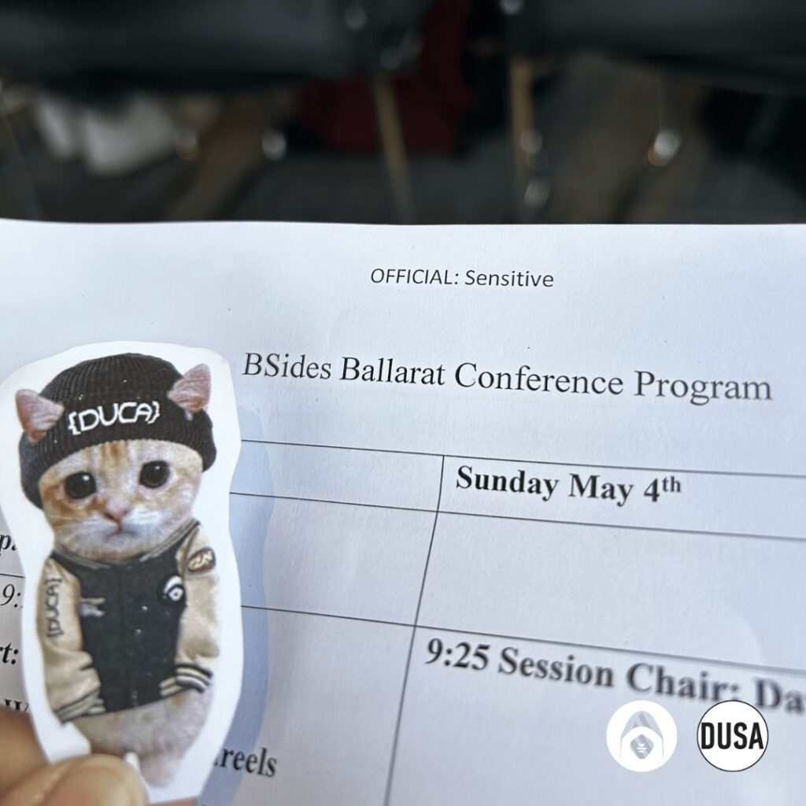
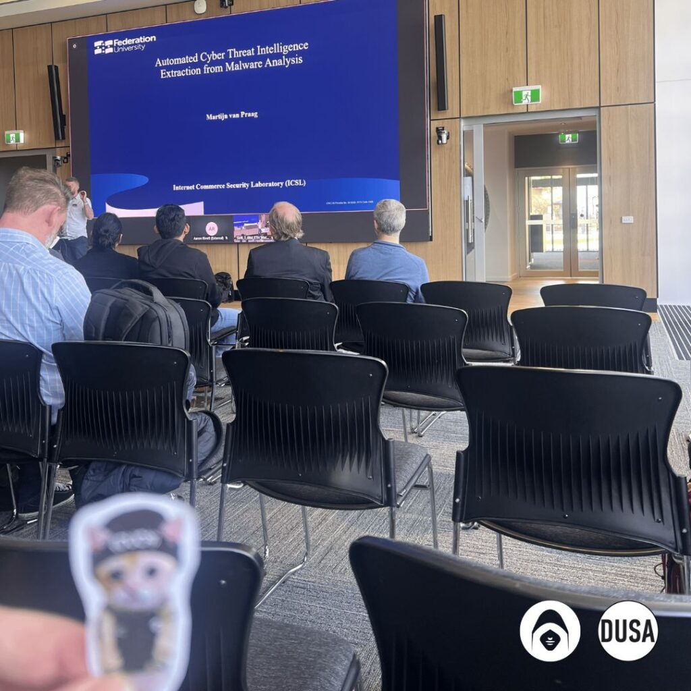
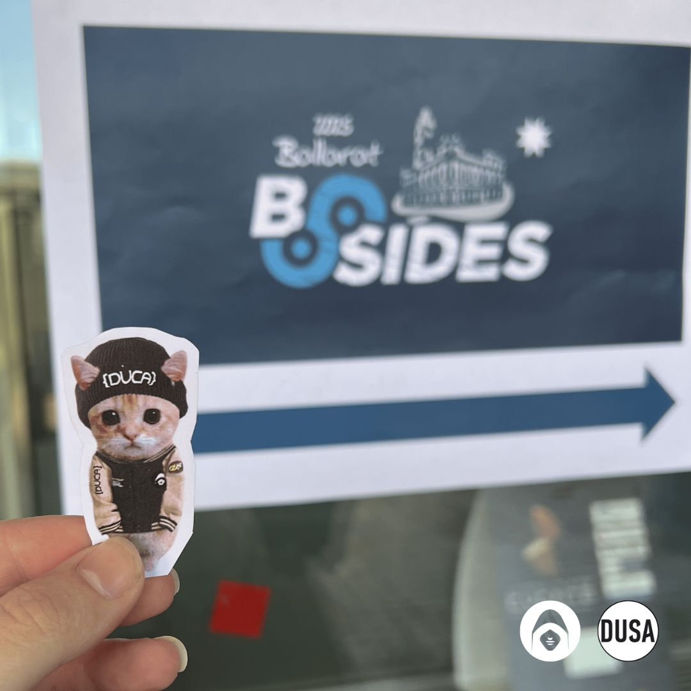
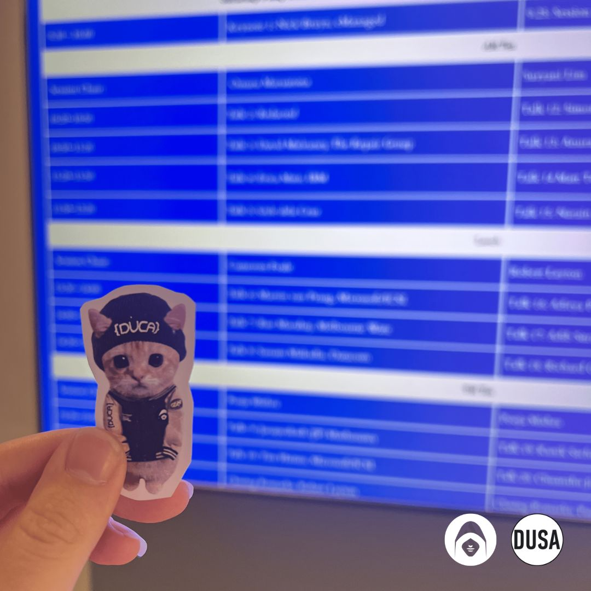

As you can tell, DUCA Cat had a wonderful time at the inaugural BSides Ballarat on 3-4 May. 🐈 He has given us permission to share some of his favourite pictures from the event.

Here is a great summary from our fellow DUCA committee member Ashley Mathew on her experience at BSides this month!

“Never too late to post… still can’t stop thinking about BSides Ballarat this past weekend!…

The day was packed with moments that really stuck with me.

David Mulraney talked about building from nothing, staying connected (even with your competition!) and staying hungry, honestly, so many real insights I’ll hold on to, especially as someone who dreams of having something of my own someday.

Erica Muir from IBM had such an insightful talk that went beyond just the technicals. Breaking down how much fraud investigation relies on understanding human behaviour and psychology, not just tools or systems. It reminded me how broad cybersecurity really is and how important it is to think both like an analyst and a detective when chasing down threats and suspicious patterns.

Gyle D. absolutely nailed the issue of oversharing. The way we casually put so much of our personal data out there? Definitely left me wanting to review my own habits and stay smarter about my digital footprint.

Martijn van Praag with the live demo and explanation of how CTI can be automated showed me how fast this area is evolving. Felt super inspired (and a little spooked xD) to keep my skills sharp and stay ahead of the curve.

Rue Maharaj with most relatable talks of the day for me. His advices of how to keep growing in cybersecurity and how cyber careers not being a straight path was refreshing and exactly what I needed to hear. It’s okay to pivot as you grow. He also spoke about how easy it is to burnout in this field and making sure to take care of yourself along the way. Something I’m looking forward to carry with me, growth is important, but so is protecting your energy…

I couldn’t attend every single talk but these ones really left a mark on me.

Events like this remind me how much I love being part of this community.”

