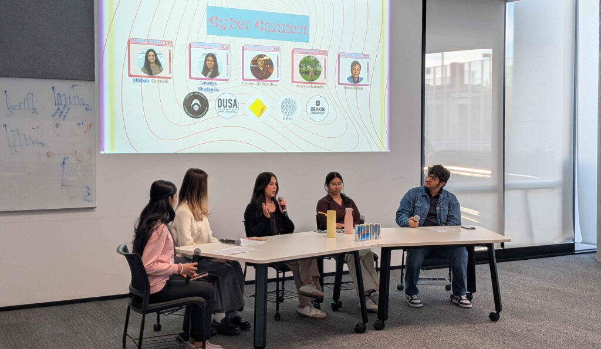
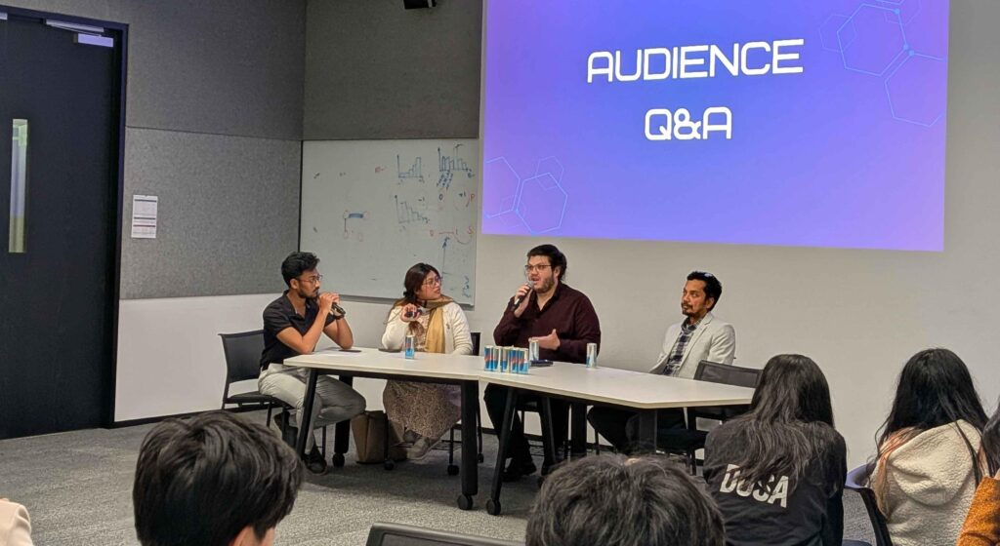

On **Friday, September 5th, 2025**, DUCA proudly partnered with the **Deakin Data Science Club (DDSC)** to host our **HUGE NETWORKING CYBER CONNECT EVENT**. It was an evening full of career advice, research discussions, and community spirit, bringing together students, industry professionals, and academics under one roof.

Even with the trimester wrapping up and assignments piling high, we were blown away by the turnout. The room was packed, and the energy showed just how committed Deakin students are to making the most of every opportunity in cyber and data science.

#### Careers in Cyber with Commonwealth Bank

The first part of the evening featured **Lavanya Bhadauria** and **Misbah Qureshi** from Commonwealth Bank, who shared their experiences moving from university into professional roles in cybersecurity. They spoke openly about the challenges of breaking into the industry and offered practical tips on how to stand out. From building a strong resume to preparing for interviews and identifying the skills that really matter, their advice gave students a real sense of what employers are looking for.

Lavanya and Misbah also shared personal stories about their own journeys – the projects they worked on, the mistakes they learned from, and the small steps that helped them progress in their careers. They stressed the importance of curiosity, being proactive, and making the most of opportunities like internships, personal projects, and networking events. Students were encouraged to ask questions, connect with mentors, and keep learning outside the classroom.

Overall, this session gave attendees a clearer picture of what a career in cybersecurity looks like, what it takes to get there, and the mindset needed to succeed. Many students left feeling inspired and motivated to take the next steps toward their own goals.

#### Research & AI with DDSC

The second half of the evening focused on research and AI, led by **Coskun (Josh) Kilinc**, **Zeseya Sharmin**, and **Dr. Ahsan Habib**. Josh shared practical advice for students on how to get involved in research, manage projects, and develop skills that go beyond the classroom. He highlighted that research isn’t just for academics, it’s about learning to ask questions, solve problems, and explore new ideas.

Zeseya and Dr. Habib shared their own experiences, talking about projects they’ve worked on, challenges they faced, and lessons they learned along the way. They also offered tips on how to approach research effectively: from defining goals clearly to collaborating with others and learning from setbacks. Throughout the session, all three speakers emphasized that persistence, curiosity, and a willingness to try new approaches are key to making meaningful progress in any project.

Students came away with a lot to think about and not just about pursuing research, but about how the skills gained through exploring new ideas and tackling challenges can apply to careers in tech, cybersecurity, and beyond. The session inspired attendees to be proactive, curious, and confident in their own abilities.

#### Food, Networking & Key Takeaways

After the talks, attendees enjoyed free food while networking with speakers and peers. The informal conversations gave students a chance to ask personal questions, swap stories, and build connections across the two clubs.

Students walked away with more than just full stomachs – they left with **career confidence, research inspiration, and new friendships**. For some, it was about learning how to stand out in the cyber job market; for others, it was about discovering a passion for academic research. But for everyone, it was a reminder of the power of community and collaboration.

#### What’s Next

This event was a big success and a perfect example of what happens when clubs like DUCA and DDSC come together. We’re already looking forward to future collaborations and more chances to bring industry, academia, and students together in meaningful ways.

A massive thank you to our speakers, to DDSC for partnering with us, and to everyone who showed up and contributed to the amazing atmosphere. This is just the start and we can’t wait to see you at the next one!
